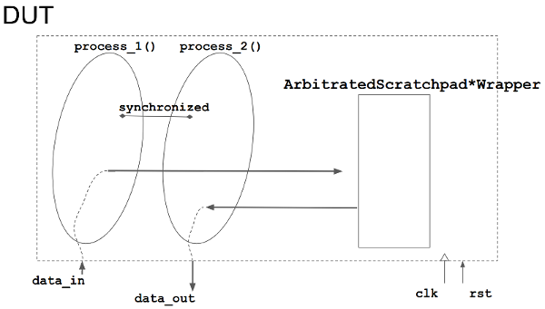
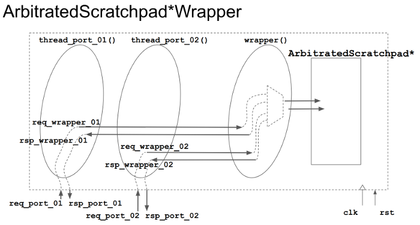

# MatchLib Arbitrated Scratchpads for SystemC Shared Memories

## Overview

We provide two example of designs, `ArbitratedScratchpadWrapper` and `ArbitratedScratchpadDPWrapper`, that use the [MatchLib memory components](https://nvlabs.github.io/matchlib/group___arbitrated_scratchpad.html) `ArbitratedScratchpad` and `ArbitratedScratchpadDP` to model shared memories.

The designs share memories among SystemC processes and are paradigmactic of the load-compute-store-process structure in ESP accelerators, but simpler.

In both the designs, the top module has two processes that behave like in the following pseudo code and image.

The processes operate in bursts (`BURST_COUNT` bursts in total) of size `BURST_SIZE`; `process_1` reads `BURST_SIZE` words from the testbench and writes them to a memory module, either a `ArbitratedScratchpadWrapper` or a `ArbitratedScratchpadDPWrapper`; these modules wrap the MatchLib arbitrated scrathpads (either single or dual ports); once `process_1` completes a burst, it syncs with the `process_2`; finally, `process_2` reads the data words back from the memory module and sends them to the testbench for validation.

```
process_1: // producer
for (i = 0; i < BURST_COUNT; i++)
    for (j = 0; j < BURST_SIZE; j++)
        data = read_data_from_testbench();
        index = (i * BURST_SIZE + j) % MEM_SIZE
        arbitrated_scratchpad_wrapper.port1.write(index, data)
    sync_with_the_other_process()

process_2: // consumer
for (i = 0; i < BURST_COUNT; i++)
    sync_with_the_other_process()
    for (j = 0; i < BURST_SIZE; i++)
        index = (i * BURST_SIZE + j) % MEM_SIZE
        data = arbitrated_scratchpad_wrapper.port2.read(index)
        write_data_to_testbench(data)
```



Notice that the two MatchLib components (`ArbitratedScratchpad` and `ArbitratedScratchpadDP`) have different programming interface.

- [ArbitratedScratchpad](https://nvlabs.github.io/matchlib/class_arbitrated_scratchpad.html)
  ```c++
  #include <ArbitratedScratchpad.h>
  ...
  ArbitratedScratchpad<DataType, ScratchpadCapacity, NumInputs, NumBanks, InputQueueLength> dut;
  dut.reset(); // optional in this case, suitable if xbar is a class member rather than local variable
  ...
  dut.load_store(curr_cli_req, curr_cli_rsp, ready);
  ...
  ```
- [ArbitratedScratchpadDP](https://nvlabs.github.io/matchlib/class_arbitrated_scratchpad_d_p.html)
  ```c++
  #include <ArbitratedScratchpadDP.h>
  ...
  ArbitratedScratchpadDP<kNumBanks, kNumReadPorts, kNumWritePorts, kEntriesPerBank, WordType, false, false> scratchpad;
  scratchpad.run(read_address, read_address_valid,
              write_address, write_address_valid,
              write_data, read_ack, write_ack, read_ready,
              read_data_out, read_data_out_valid);
  ...
  ```

We designed the memory modules (`ArbitratedScratchpadWrapper` and `ArbitratedScratchpadDPWrapper`) to **wrap** the MatchLib components with a similar request-response-based interface (`req_t` and `rsp_t`). In addition to that, each port of the memroy wrapper is served by a concurrent SystemC thread. An additional thread, wraps the MatchLib component.



## Quick Start

To replicate the experiments, make sure you had compiled the boost libraries:

```
cd <ESP>/catapult-hls-dev/accelerators/catapult_hls/common
./get_boost_1_68_0.sh
```

Then:

```
cd <ArbitratedScratchpad*Wrapper>
make
make run
make syn
```

## References

- [Slides](https://docs.google.com/presentation/d/1pwKd-JKmadxN98U0Qt4mZs1unXBNXEb6HYyhML4dOEI/edit?usp=sharing)
